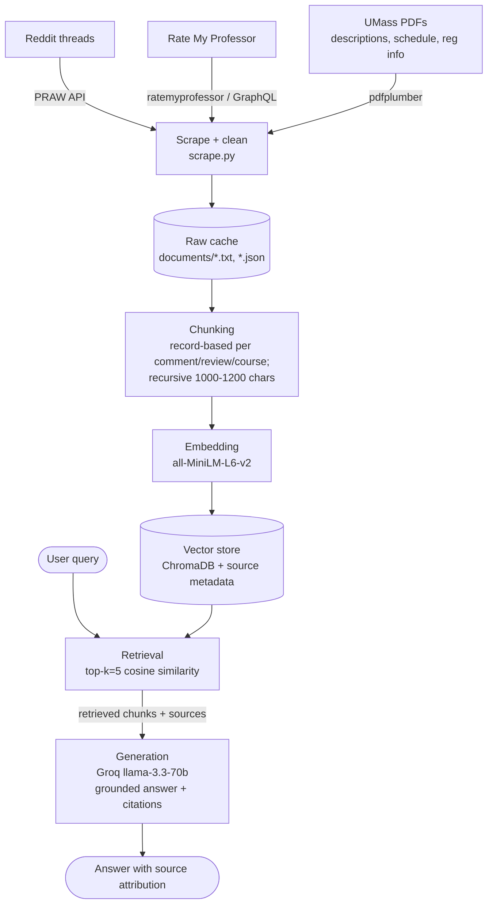

# Project 1 Planning: The Unofficial Guide

> Write this document before you write any pipeline code.
> Your spec and architecture diagram are what you'll use to direct AI tools (Claude, Copilot, etc.) to generate your implementation — the more specific they are, the more useful the generated code will be.
> Update the Retrieval Approach and Chunking Strategy sections if you change your approach during implementation.
> Update this file before starting any stretch features.

---

## Domain

<!-- What domain did you choose? Why is this knowledge valuable and hard to find through official channels? -->
My domain is Computer Science course selections: what classes to choose for electives and from the 300s to 400s, and even to 500s - graduate student's electives.
As a freshman, I find that asking advisors about which electives to take isn't effecient and useful, since they haven't taken the course yet. There are studnet Peer Advisors, but sometimes you just want a broader view of the general opinion of electives in the recent years. Extracting and combining information directly from Course Descriptions, Reddit and Rate My Professor, we can deploy a RAG system that receives well-rounded, grounded information.
---

## Documents

<!-- List your specific sources: URLs, subreddit names, forum threads, or file descriptions.
     Aim for at least 10 sources that together cover different subtopics or perspectives within your domain. -->

| # | Source | Description | URL or location |
|---|--------|-------------|-----------------|
| 1 | Reddit| Easy 200+ CS Courses |https://www.reddit.com/r/umass/comments/1ot0yto/easy_200_cs_courses/ |
| 2 | Reddit| Course recommendations MS CS |https://www.reddit.com/r/umass/comments/1da5coi/course_recommendations_ms_cs/ |
| 3 | Reddit| Thoughts on certain grad level CS classes |https://www.reddit.com/r/umass/comments/1aojcc8/thoughts_on_certain_grad_level_cs_classes/ |
| 4 | Reddit| Fall 24 CS Grad Course |https://www.reddit.com/r/umass/comments/1bymlyw/fall_24_cs_grad_course/ |
| 5 | Reddit| Easy CS electives |https://www.reddit.com/r/umass/comments/sdcne1/easy_cs_electives/ |
| 6 | Reddit| Easiest cs 400+/500+ courses.... |https://www.reddit.com/r/umass/comments/qubmte/easiest_cs_400500_courses/ |
| 7 | Reddit| CS courseload advice, 300s and 400s|https://www.reddit.com/r/umass/comments/patv3a/cs_courseload_advice/ |
| 8 | Reddit| Freshman CS Major, Second Semester Classes? |https://www.reddit.com/r/umass/comments/jdppi6/freshman_cs_major_second_semester_classes/|
| 9 | Rate My Professor | James Perretta | https://www.ratemyprofessors.com/professor/3114707 |
| 10 | Rate My Professor | Ella Tuson | https://www.ratemyprofessors.com/professor/3127793 |
| 11 | Rate My Professor | Marc Liberatore
 | https://www.ratemyprofessors.com/professor/1948400 |
| 12 | Rate My Professor | Phuthipong Bovornkeeratiroj
 | https://www.ratemyprofessors.com/professor/2992114 |
| 13 | Rate My Professor | Ghazaleh Parvini | https://www.ratemyprofessors.com/professor/2624866 |
| 14 | Rate My Professor | Justin Domke
 | https://www.ratemyprofessors.com/professor/2290260 |
| 15 | Rate My Professor | Marius Minea
 | https://www.ratemyprofessors.com/professor/2416008
| 16 | Rate My Professor | Cole Reilly | https://www.ratemyprofessors.com/professor/2912301 |
| 17 | Rate My Professor | Joe Chiu | https://www.ratemyprofessors.com/professor/2420066 |
| 18 | Rate My Professor | Mordecai Golin | https://www.ratemyprofessors.com/professor/2940693 |
| 19 | Local Repo | Spring 2026 Course Description | documents/s26_course_description.pdf |
| 20 | Local Repo | Spring 2026 Course Schedule | documents/s26_course_schedule.pdf |
| 21 | Local Repo | Spring 2026 Eligibility/Prereq. Registration Info | documents/s26_reg_info.pdf |
| 22 | Local Repo | Fall 2026 Course Description | documents/f26_course_description.pdf |
| 23 | Local Repo | Fall 2026 Course Schedule |  | documents/f26_course_schedule.pdf |
| 24 | Local Repo | Fall 2026 Eligibility/Prereq. Registration Info | documents/f26_reg_info.pdf |
---

## Chunking Strategy

<!-- How will you split documents into chunks?
     State your chunk size (in tokens or characters), overlap size, and explain why those
     numbers fit the structure of your documents.
     A review-heavy corpus warrants different chunking than a long FAQ. -->

I will use recursive chunking to chunk up the documents. Each reddit and RMP comments, and course descriptions are self contained within itself, so we should chunk the entirety of each comment, no need for overlaps. Course schedule and registration information also have a well-defined structure for each course, so we chunk each row of the tables within these documents into a chunk to maintain the integrity of the information. Course descriptions have varying information density - some go into more depth than others - so we can consider breaking the descriptions down into smaller chunks. However, this will be a stretch feature for future implementation.

**Chunk size:** Let's try 1000-1200 characters for now

**Reasoning:** Course descriptions can be long, so we need bigger chunks to not lose relevant contexts.

---

## Retrieval Approach

<!-- Which embedding model are you using (e.g., all-MiniLM-L6-v2 via sentence-transformers)?
     How many chunks will you retrieve per query (top-k)?
     If you were deploying this for real users and cost wasn't a constraint, what tradeoffs
     would you weigh in choosing a different embedding model — context length, multilingual
     support, accuracy on domain-specific text, latency? -->

For each query, ground the responses to the 5 most relevant chunks. Each chunk has the source information, source file type (Reddit Thread, Rate My Professor, Official Course information from UMass). Along with confidence metric using distance, and chunk's message.

**Embedding model:** all-MiniLM-L6-v2

**Top-k:** Use 5 most relevant chunks per query

**Production tradeoff reflection:**

---

## Evaluation Plan

<!-- List your 5 test questions with their expected correct answers.
     Questions should be specific enough that you can judge whether the system's response
     is right or wrong. "What are good dining halls?" is too vague.
     "What do students say about wait times at [dining hall name] during lunch?" is testable. -->

| # | Question | Expected answer |
|---|----------|-----------------|
| 1 | Which main 200-level COMPSCI courses are offered in Spring 2026? | COMPSCI 210, COMPSCI 220, COMPSCI 230, COMPSCI 240, COMPSCI 250 |
| 2 | | |
| 3 | | |
| 4 | | |
| 5 | | |

---

## Anticipated Challenges

<!-- What could go wrong? Name at least two specific risks with reasoning.
     Consider: noisy or inconsistent documents, missing source attribution, off-topic
     retrieval, chunks that split key information across boundaries. -->

1. **Don't have a one-size-fits-all solution for chunking**: A chunking method can't fit three doc shapes (records vs. threads)

2. **Scraping the information online**

3. **Outdated professors' ratings**

---

## Architecture

<!-- Draw a diagram of your pipeline showing the five stages:
     Document Ingestion → Chunking → Embedding + Vector Store → Retrieval → Generation
     Label each stage with the tool or library you're using.
     You can use ASCII art, a Mermaid diagram, or embed a sketch as an image.
     You'll use this diagram as context when prompting AI tools to implement each stage. -->

---

## AI Tool Plan

<!-- For each part of the pipeline below, describe:
     - Which AI tool you plan to use (Claude, Copilot, ChatGPT, etc.)
     - What you'll give it as input (which sections of this planning.md, which requirements)
     - What you expect it to produce
     - How you'll verify the output matches your spec

     "I'll use AI to help me code" is not a plan.
     "I'll give Claude my Chunking Strategy section and ask it to implement chunk_text()
     with my specified chunk size and overlap" is a plan. -->

I'm going to use Claude Code. For each milestone, the API will read the entirety of planning.md, only implementing the functionality of the milestone while keep in mind the context of the project. 

**Milestone 3 — Ingestion and chunking:**
Detailed implementation brief: see `MILESTONE3_PROMPT.md` (operationalizes this spec for the coding agent).

I'm going to ask Claude to code most of the data extraction process, since I don't have much knowledge about that. When the data is in pure JSON, or .txt files, I'm going to check the quality of the web scrape by seeing if users/profs' comments/reviews are there. I'm expecting the agent will produce a MVP with test data in the beginning, since the scraping pipeline might have to fall back in the first few iterations. 

For chunking, I'm going to ask Claude to implement the recursive_chunk() method, and I'll verify its outputs later.

**Milestone 4 — Embedding and retrieval:**
For embeddings, I'm going to use all-MiniLM-L6-v2 to embed natural language to vectors that are stored in ChromaDb.

For retrieval, I'm going to use the top 5 cosine simalrity scores, checking the distance in the retrieval process. I'm going to also print the retrived chunks to see its relevance and if it's information is enough to answer the question.

**Milestone 5 — Generation and interface:**
I'm going to prompt engineer so that the LLM can ground the chunk's informations to answering the query without outside knowledge. I'm going to ask CoPilot for possible prompt exploits and injections.

I'm going to verify outputs with eval questions.